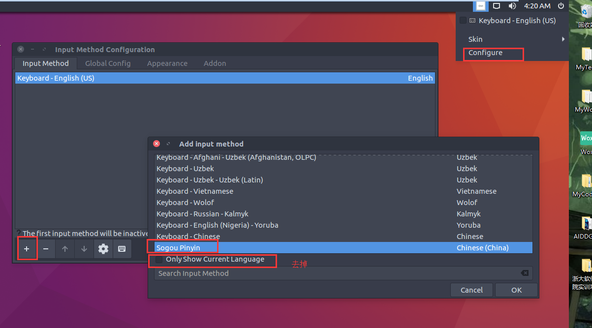
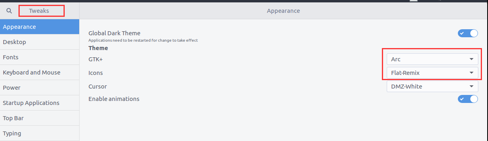

# ubuntu-desktop-scripts
A bunch of scripts to config ubuntu desktop quikly

## Usage

```shell
sudo apt-get install git
git clone https://github.com/sanmaopep/ubuntu-desktop-scripts.git
cd ubuntu-desktop-scripts/
sudo chmod +x setup.sh
./setup.sh
```

## Files
```
shells - save all scripts
tmp - save all downloaded things or something useful but big
```

## References
I can't code ubuntu desktop script without these help:

[ubuntu-make](https://github.com/Ubuntu/ubuntu-make)

[UbuntuAutoScript](https://github.com/SickoOrange/UbuntuAutoScript)

[JSON.sh](https://github.com/dominictarr/JSON.sh)

[Ubuntu_Init](https://github.com/starFalll/Ubuntu_Init)

[SDKman](http://sdkman.io/)
Notice that SDKMan support windows powershell!Wonderful!

## Notice
### 搜狗拼音的手动配置

1. Language Support添加简体中文。并将输入法设置为fcitx。
2. 输入法configuration中添加，去掉只显示当前语言，找到sougoupinyin



### 界面美化手动配置
安装完成后，打开Tweak Tool即可进行配置。

1. 设置主题为Arc，图标集为Flat Remix。




## FAQ

+ [登录后蓝屏](http://www.cnblogs.com/liaojieliang/p/ubuntu-blue.html)

+ 应用添加到应用启动器？
1. cd '/usr/share/applications'
2. sudo gedit 应用程序名字.desktop	 
3. 在弹出的文本里添加： 
```
[Desktop Entry]
Type=Application
Name=名字
Comment=描述
Icon=/应用程序所在文件夹/icon.xpm
Exec=/应用程序所在文件夹/应用程序
Terminal=false
Categories=Development;
```
4. 或者用可视化工具：gnome-desktop-item-edit

+ [ss PAC配置](http://blog.csdn.net/hanshileiai/article/details/52624303)

+ sudo 无法解析主机（换了个有个性的主机名的时候）
sudo gedit /etc/hosts
找到 127.0.0.1 XXX
修改为 127.0.0.1 （你现在的主机名）

+ 快捷键不能用（设置了Ctrl+Super+Up结果还是最大化）？
你需要工具：sudo apt-get install compizconfig-settings-manager
(unity和gnome兼容管理)
窗口管理，更改左右最大化

+ dpkg 被锁
打开系统监视器，右上角下拉选择显示所有线程，然后查找有apt开头的进程，全部杀死。